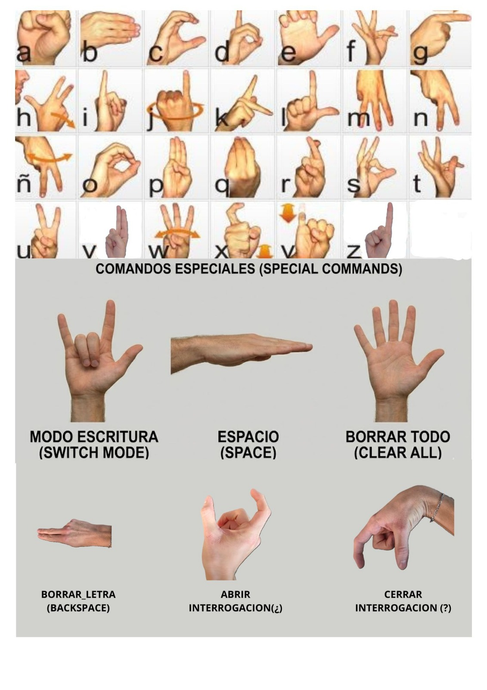

# TraductorRBMR


Buenos días profesor, somos **Mattia Rizza** y **Riccardo Belletti** **Grupo 6** y este es nuestro proyecto final de **Visión por Computador**  

[Link Projecto y Video y Dataset](https://alumnosulpgc-my.sharepoint.com/:f:/g/personal/mattia_rizza101_alu_ulpgc_es/IgC-0DDnFtsgSYzWowwpVGCvAVrgFpJ8NdjnmPI-oWncQes?e=cIqijs)

El objetivo del proyecto ha sido aplicar de manera práctica los conceptos vistos en clase queriendo crear un verdadero traductor para la **lengua de signos**.  
El proyecto no nace como un trabajo de investigación avanzada, sino como un ejercicio completo y realista. Partimos de una idea que podría parecer banal inicialmente, le hemos añadido nuestro *toque personal* y hemos conseguido sacar un buen programa que realmente se podría usar para ayudar a las personas con esta *discapacidad*.  

Al lanzar el programa se abrirá el **vídeo** y el usuario verá que nos encontramos en modo traductor; en este modo el usuario podrá practicar para **aprender la lengua de signos española** y los otros símbolos que hemos añadido para implementar acciones.  
Una vez que el usuario decide que quiere escribir un mensaje, podrá hacer el **gesto** 🤟 con las manos para entrar en el modo escritura; dentro de este modo el usuario podrá **componer cualquier mensaje letra por letra** y, una vez terminado, podrá poner el dedo sobre el icono del **micrófono** para hacer que el ordenador **pronuncie** la frase compuesta.  

Para **acelerar la escritura** hemos añadido una funcionalidad que te permite ver en pantalla **palabras recomendadas** mientras estás escribiendo, y por lo tanto, si *por ejemplo* estás escribiendo "pro" aparecerán algunas palabras como "proyecto" y poniendo el dedo encima completará la palabra.  

Además de los gestos para escribir las letras, nosotros hemos añadido a nuestro dataset otros **6 gestos** para realizar las siguientes acciones:

- entrar y salir del modo escritura
- borrar toda la frase escrita en modo escritura
- borrar solo la última letra escrita
- añadir un espacio en la frase
- añadir el signo de interrogación de apertura
- añadir el signo de interrogación de cierre
  
A continuación es posible ver la leyenda con todos los gestos utilizables. 




--- 

## Diario y Metodología de trabajo
En lo que respecta al **diario** de este *proyecto final*, muy a menudo hemos trabajado de manera presencial, ya fuera después de las clases en la *biblioteca de la universidad* o en otra *biblioteca* cercana a **Las Canteras** y para finalizar los últimos detalles, nos reunimos en casa de Riccardo.  
Por la metodologís de trabajo hemos realizado casi todo el proyecto *juntos* y de *forma presencial*, para que ambos pudiéramos entender bien lo que hacía el otro y porque ante cualquier **problema** o **duda**, en *persona* se consigue resolver casi de inmediato, en lugar de hacerlo por *teléfono*.    
Las pocas veces en las que no conseguíamos encontrarnos en persona, utilizábamos **videollamadas por WhatsApp** o, cuando uno podía y el otro no, trabajábamos de **forma individual** enviándonos mensajes cada vez que se realizaba alguna modificación o avance.

Orden cronológico del desarrollo del proyecto

## 1. Configuración del Entorno de Desarrollo

Para garantizar la reproducibilidad y el aislamiento de las dependencias, el proyecto se desarrolló dentro de un entorno virtual **Anaconda**.

```python
conda create -n proyecto_vc python=3.10
conda activate proyecto_vc
pip install mediapipe==0.10.9
pip install pyttsx3
pip install pillow
```

Se eligió **Python 3.10** para garantizar la compatibilidad completa con **MediaPipe** y las librerías de soporte utilizadas.

## 2. Dataset: Construcción y Unión de las Fuentes

Se utilizaron y unificaron dos *datasets* públicos descargados de **Kaggle**:

- Spanish Sign Language Alphabet Static
- Lenguaje de Signos Español

El objetivo de la unión fue aumentar la variedad de manos, ángulos y condiciones de iluminación, mejorando así la capacidad de generalización del modelo.  

Durante el desarrollo se observó que algunas letras **(Y, X, W, V, T, H, F)** resultaban poco fiables. Por este motivo:

- se recopilaron manualmente nuevas imágenes mediante webcam con el script **collect_data.py**
- se **sustituyó progresivamente** parte de las *imágenes* de los datasets originales por datos recogidos por nosotros, más coherentes con el entorno real de uso

## 3. Pre-procesamiento y Estandarización de los Datos con utils.py

El archivo **utils.py** representa el núcleo matemático del proyecto: actúa como “traductor” entre la visión artificial y el modelo de Machine Learning.

3.1 **Objetivos del Pre-procesamiento**
El pre-procesamiento fue diseñado para garantizar:

- **Invariancia a la traslación**
El gesto debe ser reconocido independientemente de la posición de la mano en la imagen.
- **Invariancia de escala**
El gesto debe ser reconocido tanto con la mano cerca como lejos de la cámara.
- **Compatibilidad con modelos de Machine Learning**
Los datos deben transformarse en un vector numérico adecuado para un clasificador.

3.2 **Pipeline de Procesamiento**

La función **pre_process_landmark** aplica los siguientes pasos:

1. **Copia de seguridad**
Se crea una deepcopy de los landmarks para evitar modificar los datos utilizados para el renderizado gráfico.

2. **Relativización de las coordenadas**
El *landmark* 0 (muñeca) se fija como origen (0,0). Todos los demás *puntos* se expresan como diferencia respecto a la muñeca.

3. **Flattening**
La lista de pares (x, y) se transforma en un único vector unidimensional.

4. **Normalización**
Todos los valores se escalan en el intervalo **[-1, 1]**, mejorando la estabilidad numérica y la convergencia del modelo.

**Output final**:  
Un vector de números reales listo para ser proporcionado al clasificador.

## 4. Extracción de Features con create_dataset.ipynb

Este notebook se encarga de transformar las **imágenes** en **datos numéricos**.

Pipeline:
- Carga de las imágenes organizadas por clase (A, B, C, …).
- Detección de los 21 landmarks de la mano mediante MediaPipe Hands.
- Aplicación del pre-procesamiento definido en utils.py.
- Guardado de los datos en formato numérico.

**Resultado**: un dataset estructurado y listo para el entrenamiento.

## 5. Entrenamiento del Modelo (train_classifier.ipynb)

5.1 **Elecciones de Proyecto**

Se utilizó un **Random Forest Classifier** porque:

- es robusto frente al ruido;
- no requiere feature engineering complejo;
- funciona bien con datasets de tamaño medio-pequeño.

5.2 **Fases de Entrenamiento**

- División de los datos:
  - 80% Training Set
  - 20% Test Set

- Entrenamiento del modelo
- Evaluación mediante **accuracy score**

Si la precisión supera el **95%**, el modelo se exporta como archivo estático:  
***model.p***

Este archivo representa el **“cerebro”** de la aplicación final.

## 6. Aplicación en Tiempo Real con inference_classifier.py

Este es el **archivo ejecutable**, el que utiliza el usuario final.

6.1 **Funcionalidades Principales**

- Adquisición de vídeo desde la webcam
- Detección de la mano
- Conversión de los datos visuales a datos matemáticos
- Predicción del signo
- Interfaz gráfica aumentada

6.2 **Pipeline Lógica**

Fase A – **Setup**

- Carga del modelo **model.p**
- Modo fallback si el modelo no está presente.

Fase B – **Detection**

- **MediaPipe** identifica los *21 landmarks*.
- Dibujo del esqueleto de la mano en pantalla.

Fase C – **Puente Visión → AI**

- Conversión de coordenadas normalizadas a píxeles.
- Pre-procesamiento mediante **utils.py**.

Fase D – **Inference**

- Predicción numérica del modelo.
- Traducción número → letra mediante un diccionario.

**Output visual**:

- Webcam en tiempo real
- Bounding box de la mano
- Letra reconocida

## 7. Problema Crítico: Distinción entre T y F (Profundidad)

Las letras **T y F** resultan casi indistinguibles en **2D**.

7.1 **Análisis del Problema**

En una webcam 2D las coordenadas (x, y) son casi idénticas dobemos añadir imágenes al dataset provocaba overfitting

7.2 **Solución Algorítmica**

Se aprovechó la **coordenada Z** estimada por MediaPipe:

Cálculo de la diferencia de profundidad entre:

- la punta del índice
- la punta del pulgar

Regla:

- índice más cercano a la cámara → F
- índice alineado o detrás del pulgar → T

7.3 **Calibración Experimental**

**F**: valores hasta -0.036  
**T**: valores alrededor de -0.024  
**Umbral final**: -0.028

**Resultado**: distinción estable y reproducible sin necesidad de reentrenar el modelo.

# 8. Modo Escritura y Gestión de Comandos

Se introdujeron gestos especiales para:

- **Entrar** / **salir** del modo escritura
- Insertar **espacios**
- Borrar **todo**
- Borrar el **último carácter**
- Insertar el **signo de interrogación**:

Todo esto transforma el reconocedor en un **verdadero sistema de escritura gestual**.

# 9. Text-to-Speech (Accesibilidad)

Para que el sistema sea realmente útil a personas con dificultades vocales, se integró la **síntesis de voz**.

- **Librería**: pyttsx3 (offline)
- **Voz**: española (búsqueda automática en el sistema)
- **Activación**: salida del modo escritura

Cuando el usuario termina la frase, el sistema éélee en voz altaéé el texto generado.

## 10. Soporte Unicode (Ñ, ¿)

**OpenCV** no soporta correctamente caracteres Unicode.
Por ello se integró **Pillow** para el renderizado del texto:

- Soporte completo para:
  - **Ñ**
  - **¿**
- Uso de fuentes reales **(Arial)**
- Texto limpio y legible

## 11. Sugeridor Predictivo (NLP Lite)

Se implementó un sistema de **sugerencia léxica**:

- Diccionario interno con **~350 palabras** *frecuentes* en español
- Análisis de la última palabra en tiempo real
- Visualización de sugerencias dinámicas

**Interacción Touchless**
Las sugerencias son seleccionables sin ratón:

- Hover con el índice
- Barra de carga temporal
- Selección automática

## 12. Interfaz Gráfica: Icono del Micrófono

Se añadió feedback visual mediante iconos **PNG** con transparencia:

- mic_blue.png → estado idle
- mic_yellow.png → hover
- mic_green.png → hablado

Si los iconos no están presentes, el sistema utiliza un **fallback gráfico**, evitando fallos de ejecución.


## Estructura del proyecto

La estructura principal del repositorio es la siguiente:
```
Progetto_VC/
│
├── pycache/
│
├── utils.py
│
├── create_dataset.ipynb
├── train_classifier.ipynb
│
├── model.p
│
├── traductorRBMR.py
│
├── data/
│ ├── collect_data.py
│ │
│ ├── raw/
│ │ ├── ABRIR_INTERROGACION/
│ │ ├── BORRAR_LETRA/
│ │ ├── BORRAR_TODO/
│ │ ├── CERRAR_INTERROGACION/
│ │ ├── ESPACIO/
│ │ ├── F/
│ │ ├── H/
│ │ ├── MODO_ESCRITURA/
│ │ ├── S/
│ │ ├── T/
│ │ ├── U/
│ │ ├── V/
│ │ ├── W/
│ │ ├── X/
│ │ └── Y/
│ │
│ └── new_data/
│
│
└── .DS_Store
```


## Descripción de las carpetas y de los archivos principales

### utils.py

**Objetivo del módulo**
El archivo **utils.py** contiene la *lógica matemática de transformación de los datos*. Su función principal, *get_normalized_landmarks*, actúa como un filtro intermedio entre la extracción en bruto de *+MediaPipe** y la entrada del clasificador.  
El *objetivo* es hacer que los datos sean agnósticos respecto a la posición y a la distancia de la **mano**, garantizando que el modelo aprenda la forma del gesto y no su posición en el espacio.

**Funcionamiento técnico**  
La función recibe como entrada el objeto **hand_landmarks** de MediaPipe y aplica una pipeline de transformación en tres fases:

**1. Conversión a coordenadas relativas (invarianza a la traslación)**  
Los datos en bruto de MediaPipe son coordenadas absolutas (x, y) normalizadas respecto a las dimensiones de la imagen (0.0 - 1.0).   
Si usáramos estos **datos** directamente, el modelo aprendería que una mano en la **esquina superior izquierda** es diferente de una mano en la **esquina inferior derecha**, aunque hagan el mismo gesto.  
Para resolver este problema, el código establece la muñeca (*Landmark 0*) como origen (*0, 0*) del sistema cartesiano local.  
Resta las coordenadas de la muñeca a todos los demás puntos:

```python
P'{i} = P{i} - P_{polso}
```
Encuentre las coordenadas de la muñeca (punto 0) para utilizarlas como origen.
```python
if index == 0:
    base_x, base_y = landmark_point[0], landmark_point[1]
```
Resta la base a todos los puntos (traslación del origen)
```python
temp_landmark_list[index][0] = temp_landmark_list[index][0] - base_x
temp_landmark_list[index][1] = temp_landmark_list[index][1] - base_y
```


**2. Flattening (aplanamiento)**  
Los datos se convierten de una lista de parejas bidimensionales [**[x1, y1], [x2, y2]...**] a un único vector unidimensional [**x1, y1, x2, y2...**].

Aplana la lista utilizando itertools.
```python
temp_landmark_list = list(itertools.chain.from_iterable(temp_landmark_list))
```

**3. Normalización de escala (invarianza a la escala)**
La **mano** puede estar cerca de la cámara (coordenadas grandes) o lejos (coordenadas pequeñas).  
Para hacer que el gesto sea reconocible independientemente de la distancia, los valores se normalizan dividiendo todo por el **valor absoluto máximo** presente en el vector.  
Esto fuerza a que todos los datos queden dentro de un rango entre **− 1** y **1**.

Normalizza tra **-1 y 1**
```python
max_value = max(list(map(abs, temp_landmark_list)))

def normalize_(n):
    return n / max_value if max_value != 0 else 0

temp_landmark_list = list(map(normalize_, temp_landmark_list))
```

### create_database.ipynb

**Objetivo del notebook**  
Este script constituye la fase de **Pre-processing** y **Feature Extraction** de la pipeline de Computer Vision. El objetivo no es simplemente leer las imágenes, sino transformar los datos no estructurados (píxeles de las imágenes raw) en datos estructurados (coordenadas geométricas de los landmark de la mano), listos para el entrenamiento de un clasificador (por ejemplo Random Forest).

En concreto, el notebook realiza tres tareas críticas:

1. **Iteración**: Escanea el dataset organizado en directorios.  
2. **Feature Extraction**: Utiliza MediaPipe Hands para detectar el esqueleto de la mano en cada imagen y extraer las coordenadas (x, y) de los 21 puntos clave.  
3. **Serialización**: Guarda las listas de features y las etiquetas (labels) en un formato binario comprimido (data.pickle), reduciendo drásticamente el tamaño de los datos respecto a las imágenes originales y acelerando el training.

**Requisitos previos y librerías**
Para la ejecución correcta, la estructura de directorios debe seguir la taxonomía de clases (por ejemplo data/A, data/B, etc.). Las librerías principales son:

- **MediaPipe**: para la extracción de los landmark esqueléticos (el “corazón” del pre-processing).
- **OpenCV** (*cv2*): para la manipulación de imágenes (conversión BGR -> RGB).
- **Pickle**: para la serialización de objetos Python.

**Análisis de la estructura (detalle a nivel de código)**  
Celda 1 – **Configuración del entorno**
Se definen las rutas y se inicializa el modelo estático de MediaPipe. A diferencia del script en tiempo real, aquí configuramos MediaPipe con static_image_mode=True, optimizado para imágenes individuales con alta precisión.

```python
mp_hands = mp.solutions.hands

hands = mp_hands.Hands(static_image_mode=True, min_detection_confidence=0.3)
DATA_DIR = './data'
```

Celda 2 – **Extracción de las features (Core Loop)**  
Esta es la sección computacionalmente más intensa. El código itera sobre cada subcarpeta (que representa una clase/letra) y para cada imagen ejecuta la conversión.

Pasos técnicos relevantes para cada imagen:

1. **Conversión de espacio de color**: MediaPipe requiere entrada RGB, mientras que OpenCV carga en BGR.
```python
img_rgb = cv2.cvtColor(img, cv2.COLOR_BGR2RGB)
```

2. **Inferencia MediaPipe: se calculan los landmark.**

```python
results = hands.process(img_rgb)
```

3. **Feature Extraction & Normalización** (crucial):
si se detecta una mano, no nos limitamos a extraer coordenadas crudas (x, y respecto a los bordes de la imagen). En su lugar, se invoca la función *custom get_normalized_landmarks*

```python
if results.multi_hand_landmarks:
            hand_landmarks = results.multi_hand_landmarks[0]
            normalized_landmarks = get_normalized_landmarks(hand_landmarks)
            data.append(normalized_landmarks)
            labels.append(dir_)
```

Celda 3 – **Serialización de los datos**
Los datos procesados se guardan. Este paso crea un “checkpoint”. Si en el futuro se quiere cambiar el modelo de clasificación (por ejemplo pasar de Random Forest a SVM o Red Neuronal), no será necesario reprocesar todas las imágenes, sino que bastará con cargar este archivo pickle.

```python
f = open('data.pickle', 'wb')
pickle.dump({'data': data, 'labels': labels}, f)
f.close()
```

### train_classifier.ipynb

**Objetivo del notebook**  
En este script ocurre la **transición** desde los datos geométricos (las coordenadas de los landmark extraídas en el paso anterior, create_database.ipynb) hasta la creación de un modelo de decisión capaz de clasificar nuevas entradas en tiempo real.

El objetivo es entrenar un algoritmo de Aprendizaje Supervisado para que aprenda a asociar patrones específicos de coordenadas (features) con las letras correspondientes (label).

**Librerías utilizadas**  
- *Scikit-learn* (sklearn): librería estándar de facto para ML en Python. Se utiliza para la gestión del dataset, creación del modelo y cálculo de métricas.
- *Pickle & NumPy*: para gestión eficiente de datos serializados y operaciones matriciales.

**Análisis del flujo (detalle técnico)**  
Celdas 1 & 2 – **Carga y preparación de datos**
El notebook comienza cargando el archivo **dataset.pickle** generado en la fase anterior. Las listas Python se convierten inmediatamente en **NumPy Arrays**, optimizados para cálculos vectoriales requeridos por los algoritmos de Scikit-learn, ofreciendo prestaciones superiores respecto a listas estándar.

Celda 3 – **Data Splitting y entrenamiento** (el core)
Esta celda ejecuta tres operaciones críticas para la validez científica del proyecto:

1. **Partitioning** (Train/Test Split): el dataset se divide en dos subconjuntos disjuntos:

**Training Set** *(80%)*: usado por el modelo para aprender las reglas.
**Test Set** *(20%)*: usado para evaluar el rendimiento en datos “nunca vistos antes”.

```python
x_train, x_test, y_train, y_test = train_test_split(data, labels, test_size=0.2, shuffle=True, stratify=labels)
```

2. **Selección del modelo:** se eligió *Random Forest Classifier*.  
*Motivación:* es un método *“Ensemble”* que construye una multitud de árboles de decisión. Es especialmente adecuado para este proyecto porque gestiona bien datasets con muchas features *(42 coordenadas en total)* y es robusto frente al overfitting (el riesgo de aprender “de memoria” en lugar de generalizar).

3. **Evaluación (Accuracy)**: después del entrenamiento (.fit), el modelo genera predicciones sobre el Test Set. La exactitud (accuracy_score) nos proporciona una métrica porcentual fiable sobre la capacidad del modelo para generalizar.

```python
model = RandomForestClassifier()
model.fit(x_train, y_train)
# Haz una prueba con los datos de test para ver qué tan bueno es
y_predict = model.predict(x_test)
# Calcula la accuracy
score = accuracy_score(y_predict, y_test)
```
Exactitud del modelo: 99.26%.

Celda 4 – **Serialización del modelo**
Una vez verificada una exactitud satisfactoria *(típicamente > 95%)*, el **modelo entrenado** se guarda en el archivo **model.p**.  
Este archivo contiene el objeto completo **Random Forest** (con todos sus árboles de decisión y los umbrales matemáticos calculados) y será el único archivo necesario para el script de inferencia en tiempo real (inference_classifier.py).

```python
f = open('model.p', 'wb')
pickle.dump({'model': model}, f)
f.close()
```

### collect_data.py

**Motivación y necesidad del script**

Durante las fases preliminares del proyecto, se intentó el entrenamiento utilizando exclusivamente la fusión de dos datasets públicos preexistentes. Sin embargo, las pruebas iniciales evidenciaron dos criticidades fundamentales:

1. **Heterogeneidad de los datos**: los datasets originales presentaban condiciones de iluminación, fondos y ángulos demasiado diferentes respecto al entorno operativo real, llevando a una baja capacidad de generalización del modelo (Domain Shift).

2. **Incompletitud de las clases:** no fue posible encontrar un dataset externo que cubriera perfectamente todas las clases deseadas.

Para *resolver estas problemáticas* sin tener que anotar manualmente miles de imágenes, se desarrolló el script **collect_data.py**. Esta herramienta permite integrar el dataset existente con imágenes adquiridas directamente en el entorno de uso final, mejorando drásticamente la robustez del modelo.

**Funcionamiento técnico**
El script implementa un sistema de **adquisición on-demand**. A diferencia de una grabación de vídeo continua, este enfoque permite al usuario posicionar la mano correctamente y guardar el *frame* solo cuando el gesto es perfecto, garantizando calidad del dato de entrada.  
El funcionamiento se basa en tres bloques lógicos:

1. **Setup de la cámara** (alta resolución)
Se inicializa la webcam con una resolución **HD (1280x720)**.  
Usar una resolución más alta en esta fase es crucial para garantizar que MediaPipe (en el siguiente paso) reciba suficientes detalles para extraer los landmark con precisión.

```python
cap = cv2.VideoCapture(0)
cap.set(cv2.CAP_PROP_FRAME_WIDTH, 1280)
cap.set(cv2.CAP_PROP_FRAME_HEIGHT, 720)
```

2. **Gestión dinámica de clases** (File System)
El código no requiere pre-crear las carpetas manualmente. Usando la librería os, el script verifica la entrada del teclado y gestiona automáticamente la estructura de directorios. Si el usuario pulsa la tecla "A", el script comprueba la existencia de la carpeta ./data/raw/A, la crea si es necesario, y calcula el nombre progresivo del archivo para evitar sobrescrituras.

```python
# Convertimos el código de la tecla en letra (ej. 97 -> 'a' -> 'A')
lettera = chr(key).upper()
 
# Gestión automática de la estructura de las carpetas
folder_path = os.path.join(DATA_DIR, lettera)
if not os.path.exists(folder_path):
    os.makedirs(folder_path)
```

3. **Adquisición y guardado (I/O)**
En el momento en que se pulsa la tecla, el frame actual se *“congela”* y se guarda en disco mediante **OpenCV**. Esto permite poblar rápidamente las clases menos representadas o añadir nuevas (como los comandos gestuales personalizados) en pocos segundos.

```python
# Cuenta cuántos archivos ya existen para no sobrescribirlos
count = len(os.listdir(folder_path))
          
# Guarda la imagen
file_name = f"aa{count}.jpg"
cv2.imwrite(os.path.join(folder_path, file_name), frame)
```

### traductorRBMR.py

**La infraestructura software y los motores de soporte**

El script **inference_classifier.py** no actúa como un simple ejecutor lineal, sino que se configura como un hub de integración que orquesta simultáneamente visión artificial, interfaces gráficas avanzadas, síntesis vocal y lógica predictiva.

Para superar los **límites nativos** de las librerías individuales (como la falta de soporte de transparencia en OpenCV o las operaciones bloqueantes del audio), fue necesario implementar una capa de infraestructura custom antes de entrar en el ciclo principal de procesamiento.

**El motor gráfico avanzado** *(Alpha Blending)*

Uno de los retos al desarrollar interfaces modernas con **OpenCV** es la gestión de la *transparencia*. **OpenCV** gestiona las imágenes como matrices de píxeles *BGR (Blue-Green-Red)* opacos. Para visualizar iconos modernos *(como el micrófono)* con bordes suaves y fondos transparentes, se implementó la función overlay_transparent.

Esta función ejecuta una operación matemática conocida como Alpha Blending. En lugar de sobrescribir directamente los píxeles del vídeo con los del icono (lo que resultaría en un antiestético rectángulo negro alrededor de la imagen), el código calcula una media ponderada para cada píxel basándose en su nivel de transparencia.

Analizando el código, vemos primero la separación y normalización de los canales:

```python
# Separa los canales: BGR (color) y Alpha (transparencia)
overlay_img = overlay_resized[:, :, :3] 
overlay_mask = overlay_resized[:, :, 3:] / 255.0
```

Posteriormente, se calcula la máscara inversa para el fondo (donde el icono es transparente, el fondo debe verse):
```python
background_mask = 1.0 - overlay_mask
```

Finalmente, ocurre la fusión matricial mediante álgebra lineal con NumPy:
```python
# Fusiona las imágenes: (Color del icono * Alpha) + (Fondo * (1 - Alpha))
blended_roi = (overlay_img * overlay_mask + roi * background_mask).astype(np.uint8)
```

Esta única línea de código vectorial permite obtener una interfaz de usuario fluida.

**Renderizado de texto Unicode** (El puente *OpenCV-Pillow*)  

Otra *limitación crítica* de **OpenCV** es la falta de soporte para **conjuntos de caracteres extendidos** (Unicode). Funciones estándar como *cv2.putText* no son capaces de renderizar caracteres como la **Ñ** española o el signo de interrogación invertido **¿**.  
Para resolver el problema, se creó la función **wrapper put_text_utf8**.  
Esta función actúa como un puente entre dos librerías gráficas distintas:

1. Convierte el **frame de vídeo** del formato **OpenCV** (*array NumPy**) al formato **Pillow** (*PIL Image*):

```python
img_pil = Image.fromarray(cv2.cvtColor(img, cv2.COLOR_BGR2RGB))
```

2. Utiliza el motor de renderizado de **Pillow** para dibujar el texto usando una fuente **TrueType** (*arial.ttf*), que soporta nativamente todos los glifos internacionales.

3. Reconvierten la **imagen procesada** al formato **BGR** de **OpenCV** para poder mostrarla en *vídeo*.

Este **enfoque híbrido** garantiza que la interfaz de usuario sea lingüísticamente correcta sin sacrificar el rendimiento de la pipeline de vídeo.
Además de la **conversión de formatos**, la función implementa dos mecanismos de seguridad importantes:

1.  **Fallback de Tipografía** *(Portabilidad)*: El sistema intenta cargar la fuente vectorial *arial.ttf* para asegurar una **estética moderna**. Sin embargo, dado que las fuentes disponibles varían según el sistema operativo, se encapsuló la carga en un **bloque de manejo de errores**.  
Si el archivo no se encuentra, el sistema carga automáticamente una fuente predeterminada en lugar de detener la ejecución:

```python
try:
    font = ImageFont.truetype("arial.ttf", font_size)
except IOError:
    # Mecanismo de seguridad si falta la fuente
    font = ImageFont.load_default()
```

2.  **Corrección del Espacio de Color**: Existe una discrepancia entre cómo las librerías interpretan los colores: **OpenCV** utiliza el **estándar BGR (Blue-Green-Red)**, mientras que **Pillow** utiliza **RGB**. Si pasáramos el color directamente, el texto rojo aparecería azul y viceversa.  
Por ello, el código realiza una inversión manual de los canales de color antes de dibujar:
```python
# Inversión de canales: de BGR (OpenCV) a RGB (Pillow)
color_rgb = (color[2], color[1], color[0])
```

**Gestión Asíncrona del Audio y Arquitectura Multihilo** (*Multithreading*)  

Uno de los **desafíos críticos** en los sistemas interactivos en tiempo real es la gestión de la **latencia**. La operación más costosa en términos de tiempo de ejecución no es el reconocimiento de imagen, sino la *síntesis vocal*.

La librería **pyttsx3** opera nativamente en modo bloqueante: la función **engine.runAndWait()** detiene la ejecución del procesador hasta que la frase completa ha sido pronunciada.  
Si el ordenador debe decir *"Hola, ¿cómo estás?"*, el proceso tarda entre **2 y 3 segundos**.  
En una arquitectura de un solo hilo (*Single-Threaded*), esto implicaría congelar el flujo de vídeo de la webcam durante ese tiempo, destruyendo la experiencia de usuario.

Para resolver este cuello de botella y mantener el sistema fluido a **30 FPS**, se implementó una arquitectura **Multihilo (Multithreading)** que desacopla el bucle de renderizado (**Vídeo**) del bucle de procesamiento (**Audio**).

1. **Orquestación de Hilos (run_voice_thread)**
La función **run_voice_thread** actúa como el punto de entrada para la ejecución concurrente.  
En lugar de ejecutar el audio directamente, instancia un Worker Thread:

```python
def run_voice_thread(text):
    t = threading.Thread(target=speak_function, args=(text, VOICE_ID_MANUALE))
    t.start()
```

*Desacoplamiento*: Al invocar **t.start()**, el sistema operativo crea un nuevo flujo de ejecución paralelo.

**Resultado**: El **Main Thread** (encargado del vídeo y la IA) queda libre inmediatamente para procesar el siguiente *frame*, mientras que el audio se procesa en segundo plano.

2. **Lógica de Configuración Dinámica (speak_function)**
La función **speak_function**, que se ejecuta dentro del hilo secundario, no se limita a reproducir sonido. Implementa una *lógica robusta* de autconfiguración y localización para garantizar que el sistema funcione correctamente en diferentes ordenadores.

Analizando el código, vemos tres pasos clave:

A. **Selección Automática del Idioma**: Dado que el proyecto está diseñado para la Lengua de Signos Española, el sistema no asume una configuración predeterminada.  
En su lugar, itera sobre los drivers de **voz** instalados en el sistema operativo buscando explícitamente una **voz hispana**: 

```python
voices = engine.getProperty('voices')
for v in voices:
    # Búsqueda heurística de drivers en español
    if "spanish" in v.name.lower() or "esp" in v.name.lower():
        engine.setProperty('voice', v.id)
        break
```

Este **algoritmo** de búsqueda garantiza la portabilidad del software: funcionará tanto en un Windows configurado en inglés como en uno en español, siempre que exista un paquete de voz compatible.

B. **Configuración de Velocidad**: Se ajusta la velocidad de habla (rate) a **140 palabras** por minuto para asegurar una dicción clara y natural, adecuada para fines educativos o de asistencia.

```python
engine.setProperty('rate', 140)
```

C. **Tolerancia a Fallos**: Toda la lógica de audio está encapsulada en un bloque try...except.
```python
except Exception as e: print(f"Errore Audio: {e}")
```

**El motor NLP (Natural Language Processing)**
Por último, para elevar la experiencia de usuario con la funcionalidad de “**Sugeridor Inteligente**”, se implementó un motor de **NLP ligero y determinista**.

La decisión técnica de no utilizar **redes neuronales profundas** (como LSTM, Transformers o BERT) para esta tarea específica fue dictada por la necesidad de priorizar la baja latencia.   
En un sistema de visión artificial que ya consume recursos de **GPU/CPU** para procesar *30 imágenes por segundo*, añadir un modelo de lenguaje pesado habría comprometido la fluidez del vídeo.

**Estructura y Algoritmo:** El sistema se apoya en una **Knowledge Bas**e estática (la lista **DICCIONARIO**), que ha sido curada manualmente para incluir:
- Palabras de uso común (*HOLA*, *GRACIAS*, *POR FAVOR*).
- Vocabulario específico del contexto académico/universitario (*PROYECTO*, *PROFESOR*, *EXAMEN*, *VISIÓN*).

La función **get_suggestions_list** implementa un algoritmo de **Búsqueda de Prefijos** (Prefix Matching).   
Analiza la frase en construcción en tiempo real y aísla el último fragmento escrito para ofrecer candidatos compatibles.

```python
def get_suggestions_list(current_sentence):
    if not current_sentence: return []
    parts = current_sentence.split(" ")
    last_fragment = parts[-1] # Aísla el sufijo actual (ej. "PR")
    if len(last_fragment) == 0: return [] 
    matches = []
    for word in DICCIONARIO:
        # Busca palabras que empiecen por el fragmento (startswith)
        # y evita sugerir la palabra si ya está completa
        if word.startswith(last_fragment) and word != last_fragment:
            matches.append(word)
            # Optimización: Early Exit al encontrar 3 candidatos para no saturar la UI
            if len(matches) >= 3: break 
    return matches
```

Este diseño permite obtener sugerencias instantáneas que se actualizan frame a frame mientras el usuario compone el gesto.

**Arquitectura del Ciclo de Ejecución (Runtime Loop)**
Una vez inicializados los subsistemas de soporte (Gráficos, Audio, NLP), el control del programa pasa al núcleo operativo.

El *script* está encapsulado en un bucle infinito (while True), que actúa como orquestador central gestionando la sincronización estricta entre la adquisición del mundo real (**Webcm**) y el renderizado de la información digital (**GUI**).

**Adquisición y normalización del flujo de vídeo** 
Al inicio de cada iteración, el sistema adquiere el frame bruto de la cámara

```python
while True:
    ret, frame = cap.read()
    if not ret: break
```

Sin embargo, antes de pasar a la fase de inferencia o dibujo, se ejecutan dos operaciones críticas de **pre-processing** para adecuar los datos:

- **Conversión de espacio de color**: **MediaPipe**, al estar entrenado sobre datasets *RGB*, requiere este formato específico, mientras   que OpenCV adquiere nativamente en BGR. La conversión es necesaria para garantizar la precisión del modelo.

- **Mirroring** (*Efecto espejo*): Esta operación es fundamental para la Usabilidad (*UX*). Sin el volteo horizontal (*flip*), mover la   mano física hacia la derecha provocaría un movimiento hacia la izquierda en la pantalla (como una cámara de vigilancia), creando una disonancia cognitiva que haría imposible interactuar con los botones.

**Renderizado de la Interfaz Dinámica (GUI)**
La interfaz de usuario no es estática, sino contextual: cambia según el estado del sistema. El código utiliza una lógica condicional para decidir qué elementos dibujar en pantalla.

**Modo Escritura** vs. **Modo Traductor El booleano** *is_writing_mode* actúa como un guardian gráfico:

- Si es False (**Traductor**): La interfaz es minimalista (una barra gris), invitando al usuario a realizar el gesto de activación ("**ROCK**").

- Si es True (Escritura): Se renderiza el "**Dashboard**" completo:
  - La **Barra Verde** superior, que contiene la frase en construcción.
  - El **Botón de Micrófono**, un objeto con estados (Azul = Reposo, Amarillo = Hover, Verde = Activo).
  - Las **Cajas de Sugerencias**, generadas dinámicamente iterando sobre la lista current_suggestions.

Lógica de los **Botones Virtuales** (*Interacción Sin Contacto*) Uno de los aspectos más innovadores es la implementación de botones clicables sin contacto físico.  
Dado que **no existe** un ratón o pantalla táctil, el sistema debe simular el "*clic*" usando solo la posición de la mano mediante un algoritmo en tres fases: **Mapping**, **Collision Detection** y **Temporal Filtering**.

1. **Mapeo de Coordenadas (Mapping)**:

**MediaPipe** devuelve coordenadas normalizadas (0.0→1.0). Para interactuar con la GUI, estas deben proyectarse en el espacio de píxeles de la pantalla (**1280×720**):

```python
index_x = int((1 - hand_landmarks.landmark[8].x) * W)
index_y = int(hand_landmarks.landmark[8].y * H)
```

2. **Detección de Colisiones (Collision Detection)**:

El sistema verifica si el punto **(x,y)** del dedo índice cae dentro del rectángulo de un botón (*Bounding Box*).

```python
if BTN_PARLA_X < index_x < (BTN_PARLA_X + BTN_PARLA_W) and 
   BTN_PARLA_Y < index_y < (BTN_PARLA_Y + BTN_PARLA_H):
       is_hovering_any_ui = True
```

3. **Filtrado Temporal (Dwell Time):**

El problema principal de las interfaces gestuales es el efecto "**Midas Touch**": el riesgo de clicar todo lo que se toca accidentalmente. Para evitar **falsos positivos**, se implementó un mecanismo de **Dwell Time** (tiempo de permanencia).   
El usuario debe mantener el dedo sobre el botón por un tiempo prefijado (ej. 1.0 segundo) para confirmar la intención.

Se proporciona un **Feedback Visual Progresivo**: una barra de carga amarilla se dibuja proporcionalmente al tiempo transcurrido:

```python
elapsed = time.time() - hover_start_time
load_w = int((elapsed / 1.0) * BTN_W)
cv2.rectangle(frame, ..., (BTN_X + load_w, ...), (0, 255, 255), -1)
```

Solo cuando **elapsed >= 1.0**, se dispara el evento

4. **Gestión Dinámica de Sugerencias**

Los **botones de sugerencias** se adaptan: 
- si no hay sugerencias, desaparecen;
- si hay 3, aparecen alineados calculando sus coordenadas en tiempo real:

```python
for i, word in enumerate(current_suggestions):
    bx = SUGG_START_X + (SUGG_W + SUGG_GAP) * i
    # Renderizado del rectángulo y texto...
```

Una vez que el sistema **detecta** que el usuario no está interactuando con los botones (es decir, is_hovering_any_ui == False), entra en juego el proceso de reconocimiento de gestos.

Esta fase no se limita a preguntar «*¿qué letra es?*», sino que aplica una serie de filtros lógicos y temporales para corregir los errores típicos de la visión artificial.  
El **primer paso** es consultar el modelo **Random Forest**. En lugar de preguntar simplemente por la clase ganadora (*model.predict*), el código solicita las probabilidades (*model.predict_proba*).

```python
features = get_normalized_landmarks(hand_landmarks)
prediction_proba = model.predict_proba([np.asarray(features)])
max_prob = np.max(prediction_proba)
```

Esto permite **implementar un filtro de confianza**:

```python
if max_prob < MIN_CONFIDENCE:
    # Ignora el gesto si el modelo no es lo suficientemente seguro.
```

Esto **evita** que el sistema escriba caracteres aleatorios cuando la mano está en transición o en una posición ambigua, lo que reduce drásticamente el «ruido» de fondo.

### Corrección de Errores y Post-Procesamiento

Los modelos basados únicamente en imágenes **2D** suelen confundir gestos similares. Para resolver este problema, se han inyectado en el código correctores lógicos basados en la geometría **3D** y en el análisis temporal.

A. **Corrección Geométrica 3D** (*Distinción T vs F*) 
Las letras **'T' y 'F'** en el lenguaje de señas son muy similares visualmente, pero difieren en la profundidad (qué dedo está delante del otro). **MediaPipe** proporciona la **coordenada Z** (*profundidad relativa*).   
El código calcula la distancia relativa en el eje Z entre la punta del pulgar y la del índice:

```python
diff_z = index_tip_z - thumb_tip_z
# Si la diferencia de profundidad cruza el umbral...
if diff_z < UMBRAL_LIMIT:
    predicted_character = 'F'
else:
    predicted_character = 'T'
```

B. **Análisis Temporal Dinámico (Distinción N vs Ñ)**
La **'N' y la 'Ñ'** tienen la misma forma de mano, pero la **'Ñ'** implica un movimiento ondulatorio lateral.  
Un clasificador estático no puede percibir el movimiento. Para solucionar esto, el sistema mantiene una memoria histórica (x_history) de las últimas **20 posiciones** del la muñeca:

```python
x_history.append(wrist_x)
if len(x_history) > 20:
    x_history.pop(0)

# Calcula la amplitud del movimiento reciente
movement = max(x_history) - min(x_history)
if predicted_character == 'N' and movement > UMBRAL_MOVIMIENTO_N:
    predicted_character = 'Ñ'
```

Si el sistema detecta la forma "**N**" PERO existe una oscilación significativa, "asciende" la predicción a "**Ñ**", convirtiendo un modelo estático en uno capaz de entender dinámicas temporales.

### Estabilización Temporal (Anti-Flickering)
Una vez determinada la letra (ej. "A"), no podemos escribirla inmediatamente. Los modelos de **Machine Learning** tienden a "parpadear" o fluctuar (ej. A-A-B-A-A) cientos de veces por segundo.  
Para evitar escribir "AAAAA" involuntariamente, se ha implementado un **Temporizador de Confirmación** (*CONFIRMATION_TIME = 1.5 segundos*). El sistema verifica la estabilidad de la predicción:

```python
is_stable = (predicted_character == last_char_detected)
```

- Si la letra cambia: El temporizador se **reinicia**
- Si la letra permanece igual: El temporizador **avanza**

Durante la espera, el usuario recibe un **feedback visual inmediato**: un **círculo** de carga dibujado alrededor de la mano (*cv2.ellipse*), que se rellena progresivamente.  
Esto comunica al usuario: "*He entendido que quieres hacer la A, mantenla quieta un momento más..*.".

Para **lograr** este efecto, el código calcula el ángulo del arco basándose en el tiempo transcurrido y lo dibuja sobre el frame en tiempo real:

```python
# Cálculo del porcentaje de completado (0.0 a 1.0)
progress = (time.time() - start_time) / CONFIRMATION_TIME
# Convertir a grados (0 a 360) para el arco
angle = int(progress * 360)
# Dibujar el arco progresivo alrededor de la muñeca
# -90 indica que el dibujo comienza desde la parte superior (las 12 en punto)
cv2.ellipse(frame, (wrist_x, wrist_y), (60, 60), -90, 0, angle, (0, 255, 0), 2)
```

### La Máquina de Estados (Ejecución de Comandos)

Cuando el temporizador expira (*elapsed >= CONFIRMATION_TIME*), el sistema ejecuta la acción asociada al gesto reconocido. Aquí el código actúa como una máquina de **estados finitos**.

Estado 1: **Cambio de Modalidad (SWITCH)**
Si el gesto es "**MODO_ESCRITURA**" (Rock), invierte el estado booleano *is_writing_mode*.

```python
is_writing_mode = not is_writing_mode
```

Estado 2: **Edición de Texto** 
Si estamos en modo escritura, el gesto se traduce en la manipulación de la cadena sentence:
- **Caracteres estándar**: Se concatenan a la cadena.
- **BACKSPACE**: Elimina el último carácter (sentence[:-1]).
- **BORRAR_TODO**: Elimina todo lo que se ha escrito.
- **SPACE**: Añade un espacio en blanco.

Gestión de **Disparador Único**: La variable *action_just_triggered* impide que la acción se repita infinitamente si el usuario no mueve la mano. La acción ocurre una sola vez, y luego el sistema espera a que el gesto cambie o la mano se mueva (evento "Key Up").

### Robustez y Gestión de Errores (Fault Tolerance)
Un **software** nunca debe fallar inesperadamente; por ello, ha sido blindado contra fallos críticos mediante el uso estratégico de bloques try...except.

1. **Carga de Recursos Externos**:
Al inicio, el script intenta cargar los iconos **PNG** (mic_blue.png, etc.). Si los archivos *faltan* (error común al mover el proyecto a otro PC), el código intercepta la excepción y activa la función de respaldo *create_dummy_icon*, generando recursos gráficos procedimentales sobre la marcha.

```python
except Exception as e:
    print(f"⚠️ Error cargando iconos: {e}. Usando fallback.")
    icon_blue = create_dummy_icon(...)
```

2. **Pipeline de Reconocimiento**:
Incluso durante el *ciclo principal*, el procesamiento de **MediaPipe** o la predicción del modelo podrían generar errores imprevistos (ej. valores NaN o divisiones por cero en casos límite).  
 Todo el bloque lógico está protegido:

```python
try:
    features = get_normalized_landmarks(hand_landmarks)
    # ... lógica de predicción ...
except Exception as e:
    display_text = "Err"
    # El programa continúa ejecutándose en lugar de cerrarse
```

Esto garantiza que un solo **frame corrupto** no termine la ejecución de la aplicación.

## Stack Tecnológico Utilizado
El proyecto ha sido desarrollado íntegramente en Python, aprovechando su extenso ecosistema de librerías para Inteligencia Artificial y procesamiento en tiempo real.

### 1.⁠ ⁠Visión Artificial y Procesamiento de Imágenes

**MediaPipe** *(Google)*: El núcleo del sistema. Utilizada para la detección y tracking de las manos (Hands Solution). Proporciona los 21 puntos de referencia (landmarks) en 3D.

**OpenCV** *(cv2)*: Fundamental para la captura de video, el pre-procesamiento de frames y el renderizado de toda la interfaz gráfica (GUI) dinámica (dibujo de líneas, rectángulos y texto en pantalla).

**Pillow** *(PIL)*: Utilizada para la gestión avanzada de imágenes, específicamente para cargar y superponer los iconos de la interfaz (micrófono, logos) manteniendo la transparencia (canal Alfa) que OpenCV no gestiona nativamente con facilidad.

### 2.⁠ ⁠Machine Learning y Datos

**Scikit-learn**: Librería utilizada para entrenar el modelo de clasificación. Se usó el algoritmo Random Forest Classifier por su equilibrio entre precisión y velocidad de ejecución.

**NumPy**: Esencial para las operaciones matemáticas de alto rendimiento. Se usa para convertir los landmarks en arrays, calcular distancias euclidianas y normalizar coordenadas.

**Pickle**: Módulo utilizado para la serialización del modelo entrenado (model.p), permitiendo guardarlo y cargarlo instantáneamente sin re-entrenar cada vez.

### 3.⁠ ⁠Interacción y Sistema

**Pyttsx3**: Librería de síntesis de voz (Text-to-Speech) offline. Permite que el sistema "lea" en voz alta la frase construida por el usuario.

**Threading**: Módulo de la librería estándar de Python. Crucial para ejecutar la síntesis de voz en un hilo separado, evitando que la interfaz de video se congele mientras el ordenador habla.

**Math**: Usada para cálculos trigonométricos (necesarios para dibujar el arco de carga circular).

---
## Fuentes
### 1. Literatura Científica y Algorítmica 
Para el desarrollo del sistema de seguimiento de manos, nos hemos basado en la investigación original de Google:
Lugares, F. et al. (2020). MediaPipe Hands: On-device Real-time Hand Tracking. Este documento sirvió como base teórica para comprender la topología de los 21 puntos de referencia (landmarks) y cómo se extrae la coordenada Z (profundidad relativa).

### 2. Documentación Técnica Oficial 
La implementación del código se ha guiado por la documentación oficial de las librerías utilizadas, garantizando el uso de buenas prácticas:

**Scikit-learn Documentation**: Específicamente la sección sobre Ensemble Methods y Random Forest Classifier para la optimización de hiperparámetros.

**OpenCV Documentation**: Para las funciones de procesamiento de imágenes y dibujo de primitivas gráficas.

**Python Software Foundation**: Para la gestión de hilos (threading) y manejo de excepciones.

### 3. Origen de los Datos (Enfoque Híbrido)
Para el entrenamiento del modelo, se ha optado por una estrategia mixta que combina el volumen de datos públicos con la especificidad de muestras generadas ad-hoc:

**Datasets Públicos (Base de Conocimiento)**: Se han seleccionado e integrado dos conjuntos de datos obtenidos de la plataforma Kaggle, "Spanish Sign Language Alphabet Static" y "Lenguaje de Signos Español",Estos proporcionaron una base sólida inicial con gran variabilidad de usuarios y formas de manos.

**Generación de Datos Propios (Data Augmentation)**: Para adaptar el modelo a las condiciones operativas reales, se amplió el dataset base utilizando nuestra herramienta personalizada collect_data.py.

### 4. Herramientas de Asistencia e Inteligencia Artificial Generativa 
Como soporte a la productividad y la internacionalización del proyecto, se han utilizado modelos de lenguaje extensos (LLMs) bajo supervisión humana:

**Gemini (Google) y ChatGPT (OpenAI)**: Se han empleado como herramientas auxiliares para:
- Traducción y localización: Adaptación precisa de los textos técnicos y comentarios del código del italiano al español.
- Enriquecimiento del Diccionario: Generación de listas de palabras de alta frecuencia para expandir el vocabulario del   sistema de autocompletado.
- Debugging asistido: Análisis preliminar de trazas de error (stack traces) para agilizar la identificación de fallos sintácticos menores.

---

## Propuestas de ampliación
- Se podría añadir la posibilidad de **traducir gestos dinámicos** y no solo estáticos, incorporando también la **segunda mano** para la detección.
- Se podría añadir la posibilidad de **modificar el idioma** en el que se quiere hablar y, en consecuencia, cambiar automáticamente el **diccionario** según el idioma seleccionado.
- **Ampliar el diccionario** con muchas más palabras.

## Conclusión
Este proyecto nos ha resultado muy útil para aprender nuevas formas de aplicar las tecnologías vistas en clase en un contexto real y significativo. En particular, la idea de integrar un diccionario con palabras sugeridas para facilitar la escritura ha sido una manera concreta de reflexionar sobre los sistemas de asistencia che utilizamos desde hace años en nuestros dispositivos móviles, entendiendo mejor la lógica y el diseño que hay detrás de este tipo de interfaces.  
El desarrollo del proyecto ha sido también una verdadera prueba para comprender hasta dónde podíamos llegar, especialmente teniendo en cuenta el tiempo disponible y la complejidad de integrar distintas áreas como visión artificial, aprendizaje automático, interfaz de usuario y accesibilidad.   
Trabajar en equipo, con una persona que comparte la misma motivación y ganas de aprender, ha sido fundamental para afrontar las dificultades y avanzar de forma constante.  
Hemos mostrado el vídeo de presentación del proyecto a amigos y familiares en Italia, y la reacción ha sido muy positiva, lo que nos ha confirmado el valor práctico y humano de la idea desarrollada. Esperamos que el proyecto resulte igualmente interesante y significativo para ustedes. Muchas gracias.
