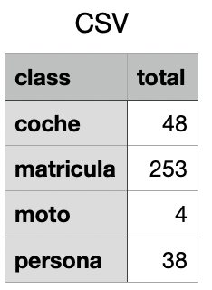
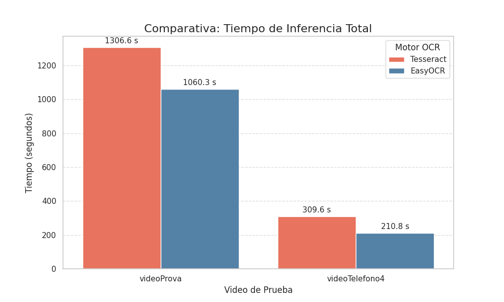
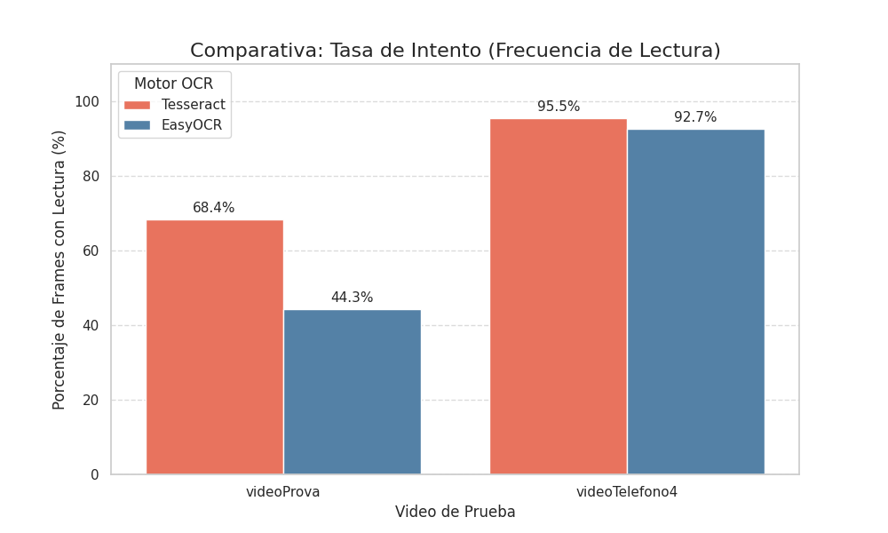

## Buenos días, profe. Somos Mattia Rizza y Riccardo Beletti, y este es nuestro README del 4 y 4b.

Para la detección inicial de matrículas, automóviles, motos y personas, buscamos información avanzada en Internet y encontramos estos pasos que nos parecieron los mejores para completar nuestra entrega inicial (la entrega 4).
---
[Link DataSet](https://alumnosulpgc-my.sharepoint.com/:f:/g/personal/mattia_rizza101_alu_ulpgc_es/EjlKID6EsRRDqddAQjm-4ycBq4TUUqFgH1ojPQkmsG_NbQ?e=SfxrWp)


Antes que nada, descargamos de Internet algunos **datasets** de coches, motos y personas, logrando obtener *400* imágenes mezcladas.
Las colocamos dentro de una carpeta y las usamos de la siguiente manera:


Primero abrimos el terminal de Anaconda y escribimos

```python
conda create --name yolo-env1 python =3.12
```

Entramos en nuestro “yolo-env1” e instalamos **label-studio**,
el programa que utilizamos para entrenar YOLO, y luego con


```python
“label-studio start”
```
Lo ejecutamos y lo abrimos actuando como **host local**, interactuando a través de nuestro *navegador*.
Creamos nuestro proyecto, insertamos todas las imágenes y luego, para cada foto, tuvimos que especificar qué era un coche, una moto, una matrícula o una persona.
El procedimiento fue largo, pero cuando lo terminamos fue muy satisfactorio haberlo logrado.

Lo exportamos en formato **YOLO with image**, y nos generó una carpeta zip que contenía

1. una carpeta con todas las imágenes utilizadas,
2. una carpeta con las “labels”,
3. un archivo con las clases (coche, matrícula, persona, moto),
4. un archivo que es nuestro dataset .json.

Tomamos el archivo zip y lo renombramos **Data**, y lo colocamos dentro de la carpeta donde está la carpeta con todas las imágenes.

Después de tener estas dos carpetas, pasamos a la parte donde empezamos a entrenar nuestro modelo utilizando *Google Collabs*, que es un servicio donde podemos escribir y ejecutar archivos Python en un navegador web utilizando la GPU ofrecida.
[Google Collabs](https://colab.research.google.com/github/EdjeElectronics/Train-and-Deploy-YOLO-Models/blob/main/Train_YOLO_Models.ipynb)

Primero nos conectamos al sitio, luego, ejecutando este código

```python
!nvidia-smi
```

verificamos que la GPU estuviera activa,
subimos nuestra carpeta *Data.zip*, la descomprimimos y le cambiamos el nombre a *custom_data* con este código


``` python
!unzip -q /content/data.zip -d /content/custom_data
```

Hecho esto, ahora estamos listos para dividir los archivos en carpetas de **Entrenamiento** y **Validación**,
donde la primera carpeta contendrá las imágenes efectivamente utilizadas por el modelo, mientras que la segunda carpeta contendrá las imágenes utilizadas para verificar el rendimiento después de cada entrenamiento.

Ejecutando este script proporcionado por el creador del sitio
 
``` python
!wget -O /content/train_val_split.py https://raw.githubusercontent.com/EdjeElectronics/Train-and-Deploy-YOLO-Models/refs/heads/main/utils/train_val_split.py
# TO DO: Improve robustness of train_val_split.py script so it can handle nested data folders, etc
!python train_val_split.py --datapath="/content/custom_data" --train_pct=0.9
``` 
creará automáticamente la estructura de carpetas requerida y moverá aleatoriamente el 90% del conjunto de datos a la carpeta “entrenamiento” y el 10% a la carpeta “validación”.

Cuando el script haya terminado, encontraremos una carpeta con las diversas subdivisiones


Posteriormente instalamos Ultralytics, que es la librería de Python que utilizaremos para entrenar el modelo YOLO.
Una vez finalizada la instalación, tuvimos que crear un archivo de configuración del entrenamiento; este archivo define la ubicación de las carpetas de Entrenamiento y Validación y establece las clases de los modelos utilizando este código proporcionado por el creador del sitio.

```python
# Python function to automatically create data.yaml config file
# 1. Reads "classes.txt" file to get list of class names
# 2. Creates data dictionary with correct paths to folders, number of classes, and names of classes
# 3. Writes data in YAML format to data.yaml

import yaml
import os

def create_data_yaml(path_to_classes_txt, path_to_data_yaml):

  # Read class.txt to get class names
  if not os.path.exists(path_to_classes_txt):
    print(f'classes.txt file not found! Please create a classes.txt labelmap and move it to {path_to_classes_txt}')
    return
  with open(path_to_classes_txt, 'r') as f:
    classes = []
    for line in f.readlines():
      if len(line.strip()) == 0: continue
      classes.append(line.strip())
  number_of_classes = len(classes)

  # Create data dictionary
  data = {
      'path': '/content/data',
      'train': 'train/images',
      'val': 'validation/images',
      'nc': number_of_classes,
      'names': classes
  }

  # Write data to YAML file
  with open(path_to_data_yaml, 'w') as f:
    yaml.dump(data, f, sort_keys=False)
  print(f'Created config file at {path_to_data_yaml}')

  return

# Define path to classes.txt and run function
path_to_classes_txt = '/content/custom_data/classes.txt'
path_to_data_yaml = '/content/data.yaml'

create_data_yaml(path_to_classes_txt, path_to_data_yaml)

print('\nFile contents:\n')
!cat /content/data.yaml
```

Ejecutando este código obtendremos el archivo *Data.yaml*.

Hecho esto, estábamos listos para nuestro **entrenamiento**.
Solo teníamos que decidir qué modelo de YOLO usar, y utilizamos el modelo *YOLO 11s* con este código:


```python
!yolo detect train data=/content/data.yaml model=yolo11s.pt epochs=60 imgsz=640
```

Iniciamos el entrenamiento.

Una vez finalizado, comprimí y descargué el modelo y lo renombré como *my_model*.

Cierro todo, vuelvo a abrir el terminal de Anaconda, entro en **yolo-env1**, luego entro en la carpeta donde coloqué mi archivo *my_model.pt* y también aquí instalo **ultralytics**.
Después, con el código Python ejecutamos nuestro modelo utilizando el video propuesto por usted, profe, y funcionaba correctamente con este código que nos proporcionó el creador del sitio web utilizamos:
```python
import os
import sys
import argparse
import glob
import time
import csv
    

import cv2
import numpy as np
from ultralytics import YOLO

# ---------------- Utils ----------------
def iou_xyxy(a, b):
    xA = max(a[0], b[0]); yA = max(a[1], b[1])
    xB = min(a[2], b[2]); yB = min(a[3], b[3])
    interW = max(0, xB - xA); interH = max(0, yB - yA)
    inter = interW * interH
    if inter <= 0:
        return 0.0
    areaA = max(0, a[2] - a[0]) * max(0, a[3] - a[1])
    areaB = max(0, b[2] - b[0]) * max(0, b[3] - b[1])
    union = areaA + areaB - inter
    if union <= 0:
        return 0.0
    return inter / union

def canonical_classname(name: str) -> str:
    s = name.strip().lower().replace('_', ' ').replace('-', ' ')
    s = ' '.join(s.split())
    # targhe
    plate_aliases = {
        'license plate','licence plate','number plate','plate',
        'vehicle plate','car plate','plate number','licence','license'
    }
    if s in plate_aliases:
        return 'license-plate'
    # motorini (se vuoi unificarli)
    moto_aliases = {'motorcycle','motorbike','moped','scooter'}
    if s in moto_aliases:
        return 'motorcycle'
    # auto
    car_aliases = {'car','automobile','vehicle','auto'}
    if s in car_aliases:
        return 'car'
    # persone
    person_aliases = {'person','pedestrian','people'}
    if s in person_aliases:
        return 'person'
    return name

# --------------- Argparse ---------------
parser = argparse.ArgumentParser()
parser.add_argument('--model', required=True)
parser.add_argument('--source', required=True)
parser.add_argument('--thresh', type=float, default=0.5)
parser.add_argument('--resolution', default=None)
parser.add_argument('--record', action='store_true')
parser.add_argument('--iou', type=float, default=0.4,
                    help='IoU threshold for matching tracks (default 0.4).')
parser.add_argument('--max_misses', type=int, default=45,
                    help='Frames to keep a track without matches (default 45).')
args = parser.parse_args()

model_path = args.model
img_source = args.source
min_thresh = float(args.thresh)
user_res = args.resolution
record = args.record
IOU_THRESH = float(args.iou)
MAX_MISSES = int(args.max_misses)

# --------------- Checks / model ---------------
if not os.path.exists(model_path):
    print('ERROR: Model path is invalid or model was not found.')
    sys.exit(0)

model = YOLO(model_path, task='detect')
labels = model.names

if isinstance(labels, dict):
    index_to_name = dict(labels)
    class_names = [index_to_name[k] for k in sorted(index_to_name.keys())]
else:
    index_to_name = {i: n for i, n in enumerate(labels)}
    class_names = list(labels)

# Cumulative unique counts + trackers per class
unique_totals = {canonical_classname(n): 0 for n in class_names}
trackers = {canonical_classname(n): [] for n in class_names}  # each: {'id', 'bbox', 'misses'}
next_ids = {canonical_classname(n): 0 for n in class_names}

# --------------- Source parsing ---------------
img_ext_list = ['.jpg','.jpeg','.png','.bmp']
vid_ext_list = ['.avi','.mov','.mp4','.mkv','.wmv']

if os.path.isdir(img_source):
    source_type = 'folder'
elif os.path.isfile(img_source):
    _, ext = os.path.splitext(img_source); ext = ext.lower()
    if ext in img_ext_list: source_type = 'image'
    elif ext in vid_ext_list: source_type = 'video'
    else:
        print(f'File extension {ext} is not supported.')
        sys.exit(0)
elif img_source.startswith('usb'):
    source_type = 'usb'
    try:
        usb_idx = int(img_source[3:])
    except:
        print('USB index must follow "usb", e.g., "usb0".'); sys.exit(0)
elif img_source.startswith('picamera'):
    source_type = 'picamera'
else:
    print(f'Input {img_source} is invalid.'); sys.exit(0)

resize = False
if user_res:
    resize = True
    try:
        resW, resH = map(int, user_res.split('x'))
    except:
        print('Resolution must be WxH, e.g. 640x480.'); sys.exit(0)

# --------------- Open source ---------------
cap = None
if source_type == 'image':
    imgs_list = [img_source]
elif source_type == 'folder':
    imgs_list = []
    for f in sorted(glob.glob(os.path.join(img_source, '*'))):
        _, e = os.path.splitext(f)
        if e.lower() in img_ext_list: imgs_list.append(f)
elif source_type in ['video','usb']:
    if source_type == 'video':
        cap = cv2.VideoCapture(img_source)
    else:
        cap = cv2.VideoCapture(usb_idx, cv2.CAP_AVFOUNDATION)
    if not cap or not cap.isOpened():
        print('ERROR: Unable to open video/camera source.'); sys.exit(0)
    if user_res:
        cap.set(cv2.CAP_PROP_FRAME_WIDTH, resW)
        cap.set(cv2.CAP_PROP_FRAME_HEIGHT, resH)
elif source_type == 'picamera':
    from picamera2 import Picamera2
    cap = Picamera2()
    if not user_res:
        print('Please specify --resolution WxH for picamera.'); sys.exit(0)
    cap.configure(cap.create_video_configuration(main={"format": 'XRGB8888', "size": (resW, resH)}))
    cap.start()

# --------------- Recorder ---------------
if record:
    if source_type not in ['video','usb']:
        print('Recording only works for video/camera.'); sys.exit(0)
    if not user_res:
        print('Please specify --resolution to record.'); sys.exit(0)
    fourcc = cv2.VideoWriter_fourcc(*'mp4v')
    recorder = cv2.VideoWriter('demo1.mp4', fourcc, 30, (resW, resH))
    if not recorder.isOpened():
        print('ERROR: Failed to open VideoWriter.'); sys.exit(0)

# --------------- Viz state ---------------
bbox_colors = [(164,120,87), (68,148,228), (93,97,209), (178,182,133), (88,159,106),
               (96,202,231), (159,124,168), (169,162,241), (98,118,150), (172,176,184)]
avg_frame_rate = 0.0
frame_rate_buffer = []; fps_avg_len = 200
img_count = 0

window_name = 'YOLO detection results'
cv2.namedWindow(window_name, cv2.WINDOW_NORMAL)

try:
    while True:
        t0 = time.perf_counter()

        # ---- Read frame ----
        if source_type in ['image','folder']:
            if img_count >= len(imgs_list):
                print('All images processed.'); break
            frame = cv2.imread(imgs_list[img_count]); img_count += 1
            if frame is None: continue
        elif source_type == 'video':
            ret, frame = cap.read()
            if not ret: print('End of video.'); break
        elif source_type == 'usb':
            ret, frame = cap.read()
            if not ret or frame is None: print('Camera read error.'); break
        elif source_type == 'picamera':
            frame_bgra = cap.capture_array()
            frame = cv2.cvtColor(np.copy(frame_bgra), cv2.COLOR_BGRA2BGR)
            if frame is None: print('Picamera read error.'); break

        if resize: frame = cv2.resize(frame, (resW, resH))

        # ---- Inference ----
        results = model(frame, verbose=False)
        detections = results[0].boxes

        # Bucket detections by canonical class name
        dets_by_class = {}  # cname -> list of (xmin,ymin,xmax,ymax, classidx, conf)
        object_count = 0

        for i in range(len(detections)):
            xyxy = detections[i].xyxy.cpu().numpy().squeeze().astype(int)
            xmin, ymin, xmax, ymax = map(int, xyxy.tolist())
            cls_idx = int(detections[i].cls.item())
            raw_name = index_to_name.get(cls_idx, str(cls_idx))
            cname = canonical_classname(raw_name)
            conf = float(detections[i].conf.item())
            if conf < min_thresh: continue

            # draw box
            color = bbox_colors[cls_idx % len(bbox_colors)]
            cv2.rectangle(frame, (xmin, ymin), (xmax, ymax), color, 2)
            label = f'{cname}: {int(conf*100)}%'
            labelSize, baseLine = cv2.getTextSize(label, cv2.FONT_HERSHEY_SIMPLEX, 0.5, 1)
            label_ymin = max(ymin, labelSize[1] + 10)
            cv2.rectangle(frame, (xmin, label_ymin - labelSize[1] - 10),
                          (xmin + labelSize[0], label_ymin + baseLine - 10), color, cv2.FILLED)
            cv2.putText(frame, label, (xmin, label_ymin - 7),
                        cv2.FONT_HERSHEY_SIMPLEX, 0.5, (0,0,0), 1)

            object_count += 1
            dets_by_class.setdefault(cname, []).append((xmin, ymin, xmax, ymax, cls_idx, conf))

        # ---- Tracking & unique counting (for ALL classes, including license-plate) ----
        for cname, dets in dets_by_class.items():
            # ensure dict keys exist (in case cname is only from canonicalization)
            if cname not in trackers:
                trackers[cname] = []
                unique_totals[cname] = 0
                next_ids[cname] = 0

            tracks = trackers[cname]
            nT = len(tracks); nD = len(dets)
            # mark updated tracks
            updated = [False] * nT
            used_tracks = set()
            used_dets = set()

            # Greedy one-to-one matching by IoU (descending)
            # Build all pair (track, det) with IoU >= thresh
            pairs = []
            for ti, tr in enumerate(tracks):
                tb = tr['bbox']
                for di, d in enumerate(dets):
                    db = d[0:4]
                    iouv = iou_xyxy(tb, db)
                    if iouv >= IOU_THRESH:
                        pairs.append((iouv, ti, di))
            # sort by IoU desc
            pairs.sort(reverse=True, key=lambda x: x[0])

            # assign
            for iouv, ti, di in pairs:
                if ti in used_tracks or di in used_dets:
                    continue
                # update track ti with det di
                tracks[ti]['bbox'] = dets[di][0:4]
                tracks[ti]['misses'] = 0
                updated[ti] = True
                used_tracks.add(ti)
                used_dets.add(di)

            # create new tracks for unmatched detections -> NEW UNIQUE objects
            for di, d in enumerate(dets):
                if di in used_dets: continue
                new_id = next_ids[cname]; next_ids[cname] += 1
                tracks.append({'id': new_id, 'bbox': d[0:4], 'misses': 0})
                updated.append(True)
                unique_totals[cname] = unique_totals.get(cname, 0) + 1

            # age & remove stale tracks
            for ti in range(len(tracks)-1, -1, -1):
                if ti >= len(updated) or not updated[ti]:
                    tracks[ti]['misses'] += 1
                if tracks[ti]['misses'] > MAX_MISSES:
                    tracks.pop(ti)

        # increment misses for classes with no detections this frame
        for cname in list(trackers.keys()):
            if cname not in dets_by_class:
                tracks = trackers[cname]
                for ti in range(len(tracks)-1, -1, -1):
                    tracks[ti]['misses'] += 1
                    if tracks[ti]['misses'] > MAX_MISSES:
                        tracks.pop(ti)

        # Overlay 
        if source_type in ['video','usb','picamera']:
            cv2.putText(frame, f'FPS: {avg_frame_rate:.2f}', (10,20),
                        cv2.FONT_HERSHEY_SIMPLEX, .7, (0,255,255), 2)
        cv2.putText(frame, f'Number of objects: {object_count}', (10,40),
                    cv2.FONT_HERSHEY_SIMPLEX, .7, (0,255,255), 2)

        x2, y2 = 260, 40
        for cname in sorted(unique_totals.keys()):
            tot = unique_totals[cname]
            if tot > 0:
                y2 += 20
                cv2.putText(frame, f'{cname} unique: {tot}', (x2, y2),
                            cv2.FONT_HERSHEY_SIMPLEX, .6, (255,255,0), 2)

        cv2.imshow(window_name, frame)
        if record: recorder.write(frame)

        # ---- Keys / close ----
        key = cv2.waitKey(0 if source_type in ['image','folder'] else 5)
        if cv2.getWindowProperty(window_name, cv2.WND_PROP_VISIBLE) < 1:
            break
        if key in (27, ord('q'), ord('Q')): break
        elif key in (ord('s'), ord('S')): cv2.waitKey()
        elif key in (ord('p'), ord('P')): cv2.imwrite('capture.png', frame)

        # ---- FPS ----
        t1 = time.perf_counter()
        fps = 1.0 / max(1e-6, (t1 - t0))
        frame_rate_buffer.append(fps)
        if len(frame_rate_buffer) > fps_avg_len: frame_rate_buffer.pop(0)
        avg_frame_rate = float(np.mean(frame_rate_buffer)) if frame_rate_buffer else 0.0

finally:
    print(f'Average pipeline FPS: {avg_frame_rate:.2f}')
    print('--- Totali unici per classe (oggetti distinti) ---')
    for cname in sorted(unique_totals.keys()):
        print(f'{cname}: {unique_totals[cname]}')

    #csv
    import csv
    with open("CSV.csv", "w", newline="") as f:
        w = csv.writer(f)
        w.writerow(["class", "total"])
        for cname in sorted(unique_totals.keys()):
            w.writerow([cname, unique_totals[cname]])
    print("CSV saved in: CSV.csv")

    if source_type in ['video','usb'] and cap is not None:
        cap.release()
    elif source_type == 'picamera' and cap is not None:
        cap.stop()
    if record:
        recorder.release()
    cv2.destroyAllWindows()
    cv2.waitKey(1)

```



y luego lo ejecutamos usando la terminal de Anaconda con esto:
```python
python yolo_detect.py --model "/Volumes/SSD/yolo/my_model/train/weights/best.pt" --source "/Volumes/SSD/yolo/videoProva.mp4" --resolution 1280x720
```

excepto que marca algunas matrículas idénticas como diferentes, porque cuando el coche se acerca, el tamaño cambia y piensa que son matrículas diferentes, intentamos encontrar una solución pero no pudimos mejorar más.

Hemos incluido el vídeo de demostración de la tarea 4 en la entrega del sitio web de ULPGC.

*(Pero para la entrega 4b hemos modificado el archivo .py ,también la forma en que lo ejecutamos y el CSV)*

Ahora pasamos a la parte del 4b.

## Entrega 4b

Para cumplir con los requisitos de la entrega en formato "cuaderno" (.ipynb), fue necesario adaptar el script yolo_detect.py original. La modificación más inmediata fue la gestión de los parámetros de entrada: el sistema argparse del script, incompatible con la ejecución por celdas, se sustituyó por una celda de configuración global al inicio del notebook donde se definen las variables.
```python
MODEL_PATH = r"C:\Users\ricca\...\best.pt"
VIDEO_SOURCE_PATH = r"C:\Users\ricca\...\videoTelefono4.mp4"
OUTPUT_VIDEO_PATH = "risultato_Tesseract2.mp4"
OUTPUT_CSV_PATH = "risultati_Tesseract2.csv"
CONF_THRESHOLD = 0.4
```
Además de esta adaptación, se implementaron otras modificaciones estructurales más profundas (como la sustitución del tracker manual y la reestructuración de la lógica de guardado CSV), las cuales se detallan a continuación.
La segunda celda de ambos notebooks se ocupa de cargar y preparar los modelos. Primero carga el YOLO ya entrenado con model = YOLO(MODEL_PATH) y le hace un “calentamiento” enviándole un dummy_frame para evitar la latencia del primer frame durante el procesado real. El calentamiento se hace así:
```python
model = YOLO(MODEL_PATH)
dummy_frame = np.zeros((720, 1280, 3), dtype=np.uint8)
model.track(dummy_frame, persist=True, verbose=False)
```
Esto es igual en las dos versiones: YOLO (y las librerías que lo envuelven) suelen cargar pesos y preparar caches la primera vez, y el dummy evita que el primer frame del vídeo sea muy lento o que falle si algo no está inicializado
Después del YOLO viene la inicialización del motor OCR. En la versión con Tesseract se configura la ruta al ejecutable de Tesseract porque en Windows Tesseract no entra sólo con pip; hay que instalar su binario y decirle al wrapper dónde está:
```python
pytesseract.pytesseract.tesseract_cmd = r'C:\Program Files\Tesseract-OCR\tesseract.exe'
pytesseract.get_tesseract_version()
```
Ese get_tesseract_version() sirve también como comprobación: si falla, te imprime un error y sabes que debes instalar o corregir ruta. En la versión con EasyOCR se carga el lector con:
```python
ocr_reader = easyocr.Reader(['en'], gpu=True)
```
y si hay problemas en GPU se intenta cargar con gpu=False. EasyOCR incluye sus propios modelos en la librería, así que su carga es más directa que Tesseract (que depende de un binario externo). La diferencia práctica para nosotros fue: Tesseract necesita instalación externa y ruta configurada, EasyOCR solo pip install easyocr y luego Reader, aunque EasyOCR puede tirar mucho de memoria si activas GPU.
La tercera celda es donde están las funciones de soporte —aquí está la lógica que reutilizan ambos notebooks y se explica el “por qué” de ciertas elecciones. La función canonical_classname(name) normaliza nombres distintos que puedan salir del detector, por ejemplo si tu modelo devuelve license plate, matricula o plate siempre lo mapea a 'license-plate'. Eso evita confusiones a la hora de contar y relacionar objetos:
```python
def canonical_classname(name: str) -> str:
    s = name.strip().lower().replace('_', ' ').replace('-', ' ')
    plate_aliases = {'license plate','licence plate','number plate','plate','vehicle plate','car plate','licence','license', 'matricula'}
    moto_aliases = {'motorcycle','motorbike','moped','scooter', 'moto'}
    car_aliases = {'car','automobile','vehicle','auto', 'coche'}
    person_aliases = {'person','pedestrian','people', 'persona'}
    if s in plate_aliases: return 'license-plate'
    if s in moto_aliases: return 'motorcycle'
    if s in car_aliases: return 'car'
    if s in person_aliases: return 'person'
    return s
```
Otra función pequeña pero útil es get_box_center(box) (centro del bounding box). Se usa para asociar la matrícula con el coche: si el centro del bounding box de la matrícula está dentro de la caja del coche, asumimos que pertenece a ese coche. Es una heurística sencilla pero eficaz en la mayoría de vídeos:
```python
def get_box_center(box):
    x1, y1, x2, y2 = box
    return int((x1 + x2) / 2), int((y1 + y2) / 2)
```
Luego viene la pieza donde los dos notebooks diferen de verdad: la función run_ocr_on_plate(...). En la versión Tesseract se hace bastante pre-procesado antes de llamar a pytesseract.image_to_string(). Las operaciones típicas que se ven son: escalado para agrandar la matrícula (mejora el OCR), conversión a gris, desenfoque ligero para quitar ruido, binarización con Otsu, y a veces añadir un borde blanco para evitar que Tesseract corte caracteres en los bordes. El llamado a Tesseract incluye parámetros para decirle que espere una línea de texto (--psm 7) y un whitelist de caracteres (-c tessedit_char_whitelist=ABCDEFGHIJKLMNOPQRSTUVWXYZ0123456789), así:
```python
img_large = cv2.resize(plate_image, (w * scale_factor, h * scale_factor), interpolation=cv2.INTER_CUBIC)
gray = cv2.cvtColor(img_large, cv2.COLOR_BGR2GRAY)
gray_blurred = cv2.medianBlur(gray, 3)
_, thresh = cv2.threshold(gray_blurred, 0, 255, cv2.THRESH_BINARY | cv2.THRESH_OTSU)
custom_config = r'--psm 7 -c tessedit_char_whitelist=ABCDEFGHIJKLMNOPQRSTUVWXYZ0123456789'
text = pytesseract.image_to_string(thresh, config=custom_config)
text = "".join(c for c in text if c.isalnum())
```
Estas etapas buscan maximizar la legibilidad de Tesseract porque es muy sensible a ruido y contraste. 
En EasyOCR, la función run_ocr_on_plate es mucho más simple. Al ser un modelo AI moderno, no necesita el pre-procesado manual de Tesseract. La función simplemente llama al lector, extrae el texto y la confianza original, y aplica un filtro minimo:
```python
def run_ocr_on_plate(plate_image):
    if plate_image.size == 0:
        return ""
    text = ""
    try:
        result = ocr_reader.readtext(plate_image, detail=1, paragraph=False)
        if result:
            text = result[0][1]
            conf = result[0][2] # Tomamos la confianza de EasyOCR
            text = "".join(c for c in text if c.isalnum()).upper()

            if conf > 0.1 and len(text) >= 3: 
                return text # Devolver solo el texto limpio
                
    except Exception as e:
        pass
    
    return ""
```
La diferencia más importante para el resultado final no está solo en estas funciones, sino en la lógica de estabilización (memoria) que se aplica a ambos modelos en la Cella 4.
Para evitar el parpadeo (flickering) donde la lectura cambia en cada frame, ambos scripts ignoran la confianza original del OCR (o usan un filtro muy bajo). En su lugar, acumulan "votos" para cada track_id en un diccionario global ocr_history.
El texto que finalmente se muestra en el video y se guarda en el CSV es el que tiene más votos (best_text), y su confianza es una "confianza de estabilidad" que calculamos nosotros (ej. votos_totales / votos_best_text). Esta estrategia se aplica tanto a Tesseract como a EasyOCR para hacer la comparativa justa y obtener un resultado visual estable.

Después de las tres primeras celdas de configuración y funciones auxiliares, el código entra en la parte más importante: el bucle principal de procesamiento.
Aquí es donde se abren los vídeos, se ejecuta el modelo YOLO en cada frame, se asocian las detecciones con los objetos que ya se estaban siguiendo, y finalmente se aplica el OCR sobre las matrículas detectadas.
En los dos notebooks (Tesseract y EasyOCR) esta parte es casi idéntica, con pequeñas diferencias únicamente en la función que lee el texto.
Primero se abre el vídeo con OpenCV y se preparan los archivos de salida.
En esta parte del código se crea el objeto cv2.VideoCapture y se comprueba que se haya abierto correctamente.
Luego se configura también el VideoWriter para poder grabar el vídeo final con los resultados, usando el códec MP4V y la misma resolución que el vídeo original:
```python
cap = cv2.VideoCapture(VIDEO_SOURCE_PATH)
if not cap.isOpened():
    print(f"ERROR: No se pudo abrir el video fuente: {VIDEO_SOURCE_PATH}")
else:
    frame_width = int(cap.get(cv2.CAP_PROP_FRAME_WIDTH))
    frame_height = int(cap.get(cv2.CAP_PROP_FRAME_HEIGHT))
    fps = int(cap.get(cv2.CAP_PROP_FPS))

    fourcc = cv2.VideoWriter_fourcc(*'mp4v')
    recorder = cv2.VideoWriter(OUTPUT_VIDEO_PATH, fourcc, fps, (frame_width, frame_height))
```
Justo después de esta parte se inicializan los diccionarios para el conteo (unique_object_ids) y para la memoria OCR (ocr_history).
Es importante notar que toda la lógica de tracking manual del script .py original ha sido eliminada. No se usa ninguna estructura track_history ni cálculos manuales de IoU.
El seguimiento ahora se gestiona directamente con la función model.track() de Ultralytics:
```python
while cap.isOpened():
    # ...
    results = model.track(frame, persist=True, verbose=False)
    # ...
    if results[0].boxes and results[0].boxes.id is not None:
        # Extraemos el ID directamente de YOLO
        track_id = int(boxes.id[i])
```
El parámetro persist=True hace que YOLO mantenga internamente las identidades (los IDs) de los objetos entre frames, algo fundamental para no contar varias veces el mismo coche o la misma persona.
A partir de aquí, el código recorre todas las detecciones (boxes) y las agrupa en listas separadas (cars_in_frame, plates_in_frame, etc.) usando la función canonical_classname().
Inmediatamente después, se aplica la lógica de OCR con estabilización (memoria) a cada plate detectada:
1.	Se llama a text = run_ocr_on_plate(plate_img) para obtener una lectura.
2.	Si la lectura es válida (if text:), se añade un "voto" al track_id correspondiente en el diccionario ocr_history.
3.	El código determina cuál es el texto más votado (best_text) y calcula su "confianza de estabilidad" (ej. 80% de los votos).
```python
if track_id in ocr_history:
    history_for_id = ocr_history[track_id]
    best_text = max(history_for_id, key=history_for_id.get)
    total_votes = sum(history_for_id.values())
    stability_conf = best_votes / total_votes

    plate['text'] = best_text
    plate['text_conf'] = stability_conf
```
Esto asegura que el texto de la matrícula no "parpadee" (flickering) en el video final.
El siguiente paso dentro del bucle es la asociación y visualización.
Primero, el código asocia las matrículas a los coches comprobando si el centro de la matrícula (get_box_center) está dentro del recuadro del coche.
Luego, dibuja los resultados:
•	Para coches, personas y motos, dibuja el recuadro y su track_id (ej. "Car ID: 24").
```python
cv2.putText(frame, f"Car ID:{car['track_id']}", (x1, y1 - 10), ...)
```
•	Para las matrículas, dibuja el texto estabilizado y la confianza de estabilidad, cumpliendo el requisito de "visualización de la matrícula leída".
```python
if plate.get('text', ''): 
                    text_to_draw = f"{plate['text']} ({plate.get('text_conf', 0):.2f})"
                    cv2.putText(frame, text_to_draw, (x1, y1 - 10), cv2.FONT_HERSHEY_SIMPLEX, 0.9, (0, 0, 255), 2)
```
Cuando se terminan los frames del vídeo, o si el usuario cierra la ventana, el bucle finaliza y se pasa a la última parte del código: guardar resultados y liberar recursos.
Cuando se terminan los frames, el bucle finaliza y se pasa a la última celda (Celda 5) para guardar los resultados.
Aquí, el script cumple con el formato CSV exacto solicitado en la entrega. El CSV generado no es un simple log de detecciones, sino un registro estructurado por objeto principal (coche, persona, moto) en cada fotograma.
1.	Para cada car (o person/moto), se crea una fila (row) con sus datos (fotograma, tipo_oggetto, confianza, identificador_tracking, x1, y1, x2, y2).
2.	Si a esa car se le ha asociado una plate, la fila se actualiza (row.update) para rellenar las columnas de la matrícula: matrícula_en_su_caso: si, confianza_matricula (la confianza de estabilidad), mx1, my1... y texto_matricula (el texto estabilizado).
3.	Todas estas filas se guardan en la lista csv_results durante el bucle.
Finalmente, en la Celda 5, el script guarda los resultados:
1.	Guardado del CSV Detallado:
 o	Convierte la lista csv_results (que contiene los datos de cada fotograma) en un DataFrame de pandas.
 o	Asegura que el DataFrame tenga exactamente las columnas y el orden solicitados en la entrega (colonne_richieste).
 o	Guarda el DataFrame en el archivo CSV (ej. risultati_EASYOCR_STABILE.csv).
```python
df = pd.DataFrame(csv_results)
df = df[colonne_richieste]
df.to_csv(OUTPUT_CSV_PATH, index=False)
```
2.	Guardado del Resumen (Conteo y Tiempo):
 o	Calcula el conteo total de cada clase usando len() sobre los set de unique_object_ids.
 o	Calcula el processing_time restando end_time y start_time.
 o	Imprime este resumen en la consola.
 o	Guarda este mismo resumen en un archivo .txt (ej. Total_clases_Tesseract2.txt), para que los datos de la comparativa       (tiempo y conteo) estén fácilmente accesibles.
```python
with open(summary_file_path, "w", encoding='utf-8') as f:
    f.write(f"Total de coches únicos rastreados: {total_cars}\n")
    # ... (etc.)
    f.write(f"Tiempo total de procesamiento: {processing_time:.2f} segundos.\n")

```
## Comparativa de Modelos OCR (Tesseract vs. EasyOCR)
Se realizó una comparativa entre dos modelos de OCR (Tesseract y EasyOCR) para evaluar su rendimiento en la extracción de texto de matrículas.
Ambos prototipos (Tesseract y EasyOCR) se ejecutaron sobre los mismos dos vídeos de prueba:
videoProva: vídeo proporcionado por el profesor
videoTelefono4: vídeo realizado por nosotros, más corto, con una matrícula en primer plano y fácil de leer, y otros dos coches que pasan.
Los datos para esta comparativa se obtuvieron analizando los archivos .csv y .txt generados por ambos prototipos.
El Tiempo de Inferencia y el Conteo Total se extrajeron directamente de los archivos de resumen .txt.
Para calcular la Tasa de Acierto, fue necesario un proceso manual: primero revisé visualmente los vídeos de prueba (videoProva y videoTelefono4) para crear una lista de matrículas correctas (la "Ground Truth"). Posteriormente, comparé esta lista "Ground Truth" con las matrículas extraídas por cada modelo, las cuales están registradas en los archivos .csv detallados (risultati_Tesseract.csv y risultati_EASYOCR.csv).

Se analizaron cuatro métricas clave:
Tiempo de Inferencia: Tiempo total para procesar el vídeo.
Tasa de Acierto: Porcentaje de matrículas únicas correctas identificadas.
Tasa de Intento: Frecuencia con la que el OCR intentó una lectura (correcta o incorrecta).
Ruido: Número de lecturas únicas incorrectas generadas.





Pequeñas Conclusiones
Basado en los datos y gráficos de la comparativa, se pueden extraer las siguientes conclusiones:

Tiempo de Inferencia: Contrariamente a la suposición inicial, EasyOCR fue significativamente más rápido en ambos vídeos (un 19% más rápido en videoProva y un 32% en videoTelefono4). La razón es que la lógica de "memoria" y "voto" que tuvimos que implementar para estabilizar Tesseract requería un costoso pre-procesamiento de imagen (escalado, blur, threshold) en cada fotograma, lo que penalizó su rendimiento. EasyOCR, al no necesitar este pre-procesamiento, resultó ser más eficiente.

Tasa de Acierto (Precisión): Los resultados de precisión fueron mixtos. Tesseract ganó por poco en el videoProva (8.7% vs 4.3%), mientras que EasyOCR fue el único capaz de leer una matrícula en el videoTelefono4 (33.3% vs 0%).

Conclusión Clave (Ruido vs. Intento): El Gráfico 3 y la tabla de métricas revelan la conclusión más importante. En videoTelefono4, ambos modelos "intentaron" leer la matrícula en casi todos los fotogramas (Tasa de Intento > 90%). Sin embargo, Tesseract produjo 15 lecturas únicas incorrectas (mucho "ruido"), mientras que EasyOCR solo produjo 5. Lo mismo ocurrió en videoProva, donde Tesseract generó 40 lecturas incorrectas frente a las 17 de EasyOCR.

Veredicto Final: Aunque la precisión de ambos fue baja debido a la dificultad de los vídeos, EasyOCR es el modelo superior. Es más rápido, genera mucho menos "ruido" (lecturas basura) y fue el único capaz de gestionar los ángulos difíciles del videoTelefono4. Tesseract demostró ser poco fiable, lento (debido al pre-procesamiento) y ruidoso para esta tarea específica.


